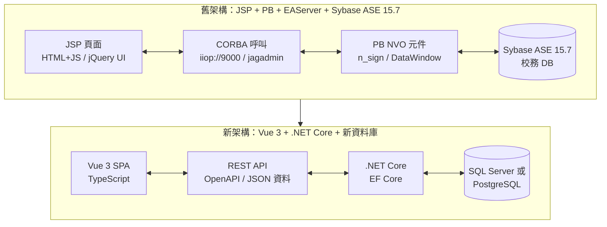

## 1. 總體策略

### 1.1 核心觀念：舊系統的每個元件，在新架構中各有對應角色

### 1.2 舊元件 → 新元件 對應總表

| 舊系統元件 | AI 能提取什麼 | 新系統對應 | 負責團隊 |
|-----------|-------------|-----------|---------|
| **PB 的 HTML 字串拼接** | 頁面佈局、欄位清單、表格結構 | → **SVG Wireframe** → Vue 3 元件 | 前端 |
| **DataWindow (.srd)** | SQL、欄位型別、參數、JOIN 關係 | → **DTO / Entity / OpenAPI Schema** | 後端 |
| **PB method 簽章** | 輸入參數、回傳值、存取的 DataWindow | → **REST API Endpoint 定義** | 共同 |
| **PB method 商業邏輯** | if/else 規則、流程判斷、DB 寫入 | → **.NET Core Service 層** | 後端 |
| **JSP 中的 JavaScript** | 表單驗證、互動邏輯、AJAX 呼叫 | → **Vue 3 前端驗證 + Composable** | 前端 |
| **JSP Session 檢查** | 認證模式、傳遞參數 | → **JWT / 認證中介層** | 後端 |

---

