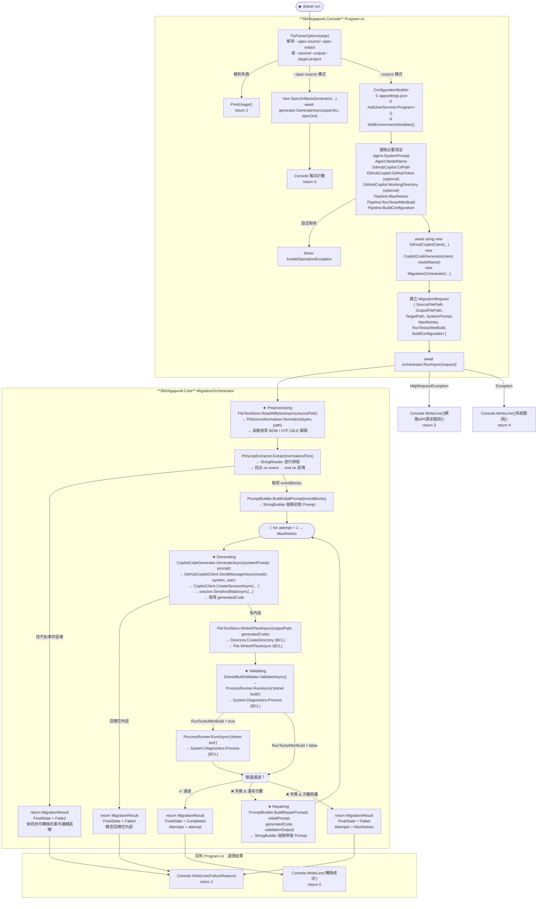

# Flowchart

本文件說明 `SktVegapunk.Console/Program.cs` 如何串接 Core 函式庫與 .NET 內建 API。

---

## 整體架構總覽

程式支援兩種執行模式：

```
SktVegapunk.Console            SktVegapunk.Core            .NET BCL / 外部
─────────────────              ──────────────────          ───────────────
Program.cs
  ├─ TryParseOptions()
  ├─ ConfigurationBuilder      ←────────────────────────── Microsoft.Extensions.Configuration
  │
  ├─ [spec 模式 --spec-source]
  │    └─ SpecArtifactsGenerator ← SpecArtifactsGenerator.cs
  │         ├─ PbSourceNormalizer ← PbSourceNormalizer.cs
  │         ├─ SrdExtractor / SruExtractor / JspExtractor
  │         ├─ SpecReportBuilder
  │         ├─ SchemaExtractor   ← SchemaExtractor.cs
  │         ├─ SchemaReconciliationAnalyzer
  │         └─ EndpointDataWindowAnalyzer
  │
  └─ [migration 模式 --source]
       ├─ GitHubCopilotClient    ←── GitHubCopilotClient.cs
       ├─ CopilotCodeGenerator   ← CopilotCodeGenerator.cs
       └─ MigrationOrchestrator  ← MigrationOrchestrator.cs
            ├─ FileTextStore     ← FileTextStore.cs ──── File.ReadAllBytesAsync / WriteAllTextAsync
            ├─ PbSourceNormalizer
            ├─ PbScriptExtractor ← PbScriptExtractor.cs ── StringReader / StringBuilder
            ├─ PromptBuilder     ← PromptBuilder.cs ────── StringBuilder
            ├─ CopilotCodeGenerator
            └─ DotnetBuildValidator ← DotnetBuildValidator.cs
                 └─ ProcessRunner ← ProcessRunner.cs ─── System.Diagnostics.Process
```

---

## 詳細流程圖



---

## 各元件職責對照表

| 元件 | 所在檔案 | 職責 | 依賴的 .NET API |
|------|----------|------|----------------|
| `Program.Main` | `Console/Program.cs` | 入口點：解析參數、組裝依賴、呼叫 Orchestrator | `Console`, `Task`, `ConfigurationBuilder` |
| `TryParseOptions` | `Console/Program.cs` | 解析 CLI 參數（spec 模式：`--spec-source` / `--spec-output`；migration 模式：`--source` / `--output` / `--target-project`） | — |
| `ConfigurationBuilder` | .NET BCL | 分層載入設定（json → secrets → 環境變數） | `Microsoft.Extensions.Configuration` |
| `GitHubCopilotClient` | `Core/GitHubCopilotClient.cs` | 封裝 GitHub Copilot SDK session 建立與回應等待 | `GitHub.Copilot.SDK`, `CopilotClient`, `SendAndWaitAsync` |
| `CopilotCodeGenerator` | `Core/Pipeline/CopilotCodeGenerator.cs` | 實作 `ICodeGenerator`，委派給 `GitHubCopilotClient` | — |
| `PbSourceNormalizer` | `Core/Pipeline/PbSourceNormalizer.cs` | 實作 `ISourceNormalizer`，偵測 BOM 並以 UTF-16LE 解碼 PB 原始碼 | — |
| `FileTextStore` | `Core/Pipeline/FileTextStore.cs` | 實作 `ITextFileStore`，讀寫磁碟檔案 | `File.ReadAllBytesAsync`, `File.WriteAllTextAsync`, `Directory.CreateDirectory` |
| `PbScriptExtractor` | `Core/Pipeline/PbScriptExtractor.cs` | 實作 `IPbScriptExtractor`，從 PB 原始碼提取事件區塊 | `StringReader`, `StringBuilder` |
| `PromptBuilder` | `Core/Pipeline/PromptBuilder.cs` | 實作 `IPromptBuilder`，組裝初始與修復 Prompt | `StringBuilder` |
| `DotnetBuildValidator` | `Core/Pipeline/DotnetBuildValidator.cs` | 實作 `IBuildValidator`，呼叫 `dotnet build/test` | — |
| `ProcessRunner` | `Core/Pipeline/ProcessRunner.cs` | 實作 `IProcessRunner`，執行外部 CLI 程序 | `System.Diagnostics.Process` |
| `MigrationOrchestrator` | `Core/Pipeline/MigrationOrchestrator.cs` | 實作 `IMigrationOrchestrator`，協調整條 Pipeline | — |

---

## 狀態機轉換

`MigrationState` 描述 Orchestrator 每個階段的狀態：

```
Preprocessing → Generating → Validating
                                  │
                  ┌───────────────┤
                  ↓               ↓
              Repairing ──→  Completed
              (重新 Generating)
                  │
                  ↓（次數耗盡）
                Failed
```

---

## Exit Code 對照

| Exit Code | 意義 |
|-----------|------|
| `0` | 轉換成功並通過驗證 |
| `1` | CLI 參數解析失敗 |
| `2` | 轉換失敗（模型或驗證問題） |
| `3` | 網路 / API 請求錯誤 |
| `4` | 其他系統錯誤 |
